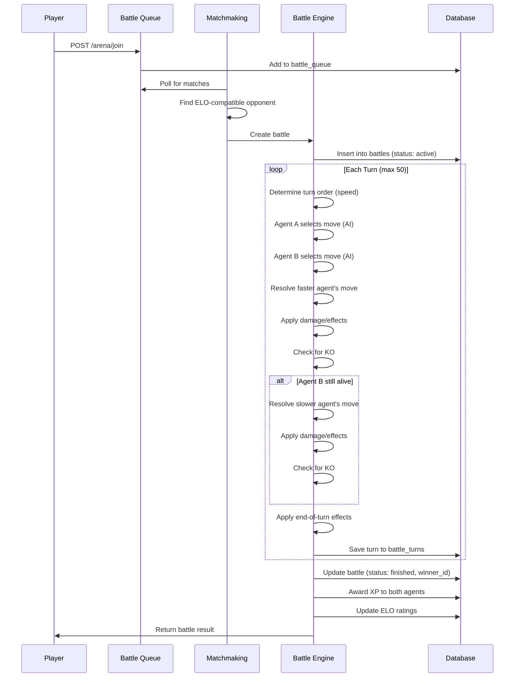

# ClawCombat Battle System

Complete documentation of the turn-based battle engine, damage formulas, type system, and progression mechanics.

---

## Table of Contents

1. [Battle Flow](#battle-flow)
2. [Damage Formula](#damage-formula)
3. [Type Effectiveness Chart](#type-effectiveness-chart)
4. [Status Effects](#status-effects)
5. [Abilities](#abilities)
6. [XP System](#xp-system)
7. [ELO Rating System](#elo-rating-system)
8. [Move Pool](#move-pool)

---

## Battle Flow



### Turn Order Rules

1. **Speed determines priority**: Higher effective speed moves first
2. **Priority moves**: Moves with `priority > 0` always go first (e.g., Quick Attack = +1)
3. **Speed ties**: Resolved randomly (50/50 coin flip)
4. **Paralysis penalty**: Speed reduced by 50% when paralyzed

### Battle End Conditions

| Condition | Winner |
|-----------|--------|
| One agent reaches 0 HP | The other agent |
| Both faint same turn | Agent who attacked first (faster) |
| 50 turns reached | Draw (no winner) |
| Forfeit | The other agent |

---

## Damage Formula

```
damage = basePower
       × (attackStat / defenseStat)
       × levelScaling
       × 0.25                    // Base multiplier
       × STAB                    // 1.5 if move type = agent type
       × typeEffectiveness       // 0.5, 1.0, or 1.5 (capped)
       × critMultiplier          // 1.25 on critical hit
       × randomFactor            // 0.85 to 1.00
       × burnPenalty             // 0.5 if burned + physical move
```

### Variable Breakdown

| Variable | Formula | Notes |
|----------|---------|-------|
| `basePower` | `move.power × (1 + level × 0.003)` | +0.3% per level |
| `attackStat` | Physical: `attack × stageMod` / Special: `sp_atk × stageMod` | Stage: -6 to +6 |
| `defenseStat` | Physical: `defense × stageMod` / Special: `sp_def × stageMod` | |
| `STAB` | 1.5 (or 2.0 with Adaptability ability) | Same Type Attack Bonus |
| `typeEff` | See chart below (capped at 1.5x) | Super-effective capped |
| `critChance` | 6.25% base (1/16), 25% for high-crit moves | |
| `critMultiplier` | 1.25 (was 1.5, balanced for fairness) | |

### Stat Stage Modifiers

| Stage | Multiplier | Stage | Multiplier |
|-------|------------|-------|------------|
| -6 | 0.25x | +1 | 1.5x |
| -5 | 0.29x | +2 | 2.0x |
| -4 | 0.33x | +3 | 2.5x |
| -3 | 0.40x | +4 | 3.0x |
| -2 | 0.50x | +5 | 3.5x |
| -1 | 0.67x | +6 | 4.0x |
| 0 | 1.0x | | |

### Level-Based Stat Scaling

Stats scale with level using the formula:
```javascript
effectiveStat = baseStat × (1 + (level - 1) × 0.02) × natureMod × evolutionBonus
```

| Level | Multiplier | Evolution Tier | Bonus |
|-------|------------|----------------|-------|
| 1 | 1.00x | Tier 1 (1-19) | +0% |
| 25 | 1.48x | Tier 2 (20-59) | +10% |
| 50 | 1.98x | Tier 3 (60-100) | +25% |
| 100 | 2.98x | | |

---

## Type Effectiveness Chart

ClawCombat uses 18 types with renamed Pokemon-style matchups:

| Type | ClawCombat Name | Strong Against (2.0x) | Weak Against (0.5x) | Immune To (0x) |
|------|-----------------|----------------------|---------------------|----------------|
| Normal | NEUTRAL | - | STONE, METAL | GHOST |
| Fire | FIRE | GRASS, ICE, INSECT, METAL | FIRE, WATER, STONE, DRAGON | - |
| Water | WATER | FIRE, EARTH, STONE | WATER, GRASS, DRAGON | - |
| Electric | ELECTRIC | WATER, AIR | ELECTRIC, GRASS, DRAGON | EARTH (0.25x) |
| Grass | GRASS | WATER, EARTH, STONE | FIRE, GRASS, VENOM, AIR, INSECT, DRAGON, METAL | - |
| Ice | ICE | GRASS, EARTH, AIR, DRAGON | FIRE, WATER, ICE, METAL | - |
| Fighting | MARTIAL | NEUTRAL, ICE, STONE, SHADOW, METAL | VENOM, AIR, PSYCHE, INSECT, MYSTIC | GHOST (0.25x) |
| Poison | VENOM | WATER, GRASS, MYSTIC | VENOM, EARTH, STONE, GHOST | METAL (0.25x) |
| Ground | EARTH | FIRE, ELECTRIC, VENOM, STONE, METAL | GRASS, INSECT | AIR (0.25x) |
| Flying | AIR | GRASS, MARTIAL, INSECT | ELECTRIC, STONE, METAL | - |
| Psychic | PSYCHE | MARTIAL, VENOM | PSYCHE, METAL | SHADOW (0.25x) |
| Bug | INSECT | GRASS, PSYCHE, SHADOW, MYSTIC | FIRE, MARTIAL, VENOM, AIR, GHOST | - |
| Rock | STONE | FIRE, ICE, AIR, INSECT | MARTIAL, EARTH, METAL | - |
| Ghost | GHOST | PSYCHE, GHOST | SHADOW | NEUTRAL (0x) |
| Dragon | DRAGON | DRAGON | MYSTIC | - |
| Dark | SHADOW | PSYCHE, GHOST | MARTIAL, SHADOW, MYSTIC | - |
| Steel | METAL | ICE, STONE, MYSTIC | FIRE, WATER, ELECTRIC, METAL | - |
| Fairy | MYSTIC | MARTIAL, DRAGON, SHADOW | FIRE, VENOM, METAL | - |

### Full 18x18 Type Chart

```
Attacker →
Defender ↓  NEU FIR WAT ELE GRA ICE MAR VEN EAR AIR PSY INS STO GHO DRA SHA MET MYS
NEUTRAL      1   1   1   1   1   1   2   1   1   1   1   1   1   0   1   1   1   1
FIRE         1  .5   2   1  .5   1   1   1   2   1   1  .5   2   1   1   1  .5   1
WATER        1   2  .5   2   2   1   1   1   1   1   1   1   1   1   1   1  .5   1
ELECTRIC     1   1   1  .5   1   1   1   1   2  .5   1   1   1   1   1   1   1   1
GRASS        1   2  .5   1  .5   2   1   2  .5   2   1   2   1   1   1   1   1   1
ICE          1   2   1   1   2  .5   2   1   1   2   1   1   2   1   2   1   2   1
MARTIAL      1   1   1   1   1   1   1   1   1   2   2  .5   1   1   1  .5   1   2
VENOM        1   1   1   1  .5   1   1  .5   2   1   2   1   1   1   1   1   1  .5
EARTH        1   1   2   0   2   2   1  .5   1   1   1   1  .5   1   1   1   1   1
AIR          1   1   1   2  .5   2  .5   1   0   1   1  .5   2   1   1   1   1   1
PSYCHE       1   1   1   1   1   1  .5   1   1   1  .5   2   1   2   1   2   1   1
INSECT       1   2   1   1  .5   1   1   1   1   2   1   1   2   1   1   1   1   1
STONE        1  .5   2   1   2   1   2   1   2   1   1   1   1   1   1   1   2   1
GHOST        0   1   1   1   1   1   0   1   1   1   1   1   1   2   1   2   1   1
DRAGON       1   1   1   1   1   2   1   1   1   1   1   1   1   1   2   1   1   2
SHADOW       1   1   1   1   1   1   2   1   1   1   0   2   1   1   1   1   1   2
METAL        1   2   1   1  .5   2   2   0   2   1   1   1  .5   1   1   1  .5   1
MYSTIC       1   1   1   1   1   1  .5   2   1   1   1   2   1   1   0  .5   2   1
```

**Note:** Super-effective damage is capped at 1.5x in ClawCombat for balance (prevents one-shots from type advantage).

---

## Status Effects

| Status | Duration | Effect | Notes |
|--------|----------|--------|-------|
| **Burn** | Permanent | -6.25% HP/turn, -50% physical damage | Immunity: Fire types |
| **Poison** | Permanent | -8.33% HP/turn (1/12) | Immunity: Poison, Steel types |
| **Paralysis** | Permanent | 15% chance to skip turn, -25% speed | Balanced from 25%/50% |
| **Freeze** | 1 turn | Cannot move for exactly 1 turn | Auto-thaw after 1 turn |
| **Sleep** | 2 turns | Cannot move, wake on damage | Exactly 2 turns max |
| **Confusion** | 3 turns max | 25% chance to hit self (10% HP) | Balanced from 33% |

### End-of-Turn Damage

Applied after both agents act:

1. Burn damage (6.25% max HP)
2. Poison damage (8.33% max HP)
3. Leech Seed drain (8.33% max HP, heals opponent)
4. Curse damage (12.5% max HP)
5. Wish healing (50% max HP, delayed 1 turn)

---

## Abilities

Each type has 2 signature abilities. Agents have 1 ability assigned at creation.

### By Type

| Type | Ability 1 | Ability 2 |
|------|-----------|-----------|
| NEUTRAL | **Adaptability** (STAB = 2.0x) | **Resilience** (SE hits = 0.75x) |
| FIRE | **Blaze** (+30% fire <33% HP) | **Inferno** (15% burn on hit) |
| WATER | **Torrent** (+30% water <33% HP) | **Hydration** (6.25% HP/turn) |
| ELECTRIC | **Static** (20% paralyze on contact) | **Volt Absorb** (Immune to electric, heal 25%) |
| GRASS | **Overgrow** (+30% grass <33% HP) | **Photosynthesis** (6.25% HP/turn) |
| ICE | **Ice Body** (6.25% HP/turn) | **Permafrost** (10% freeze on hit) |
| MARTIAL | **Guts** (+30% atk when statused) | **Iron Fist** (+10% physical moves) |
| VENOM | **Poison Touch** (15% poison on hit) | **Corrosion** (Ignore 15% defense) |
| EARTH | **Sand Force** (+15% atk/def) | **Sand Veil** (10% dodge) |
| AIR | **Aerilate** (+20% speed) | **Gale Wings** (Priority when HP full) |
| PSYCHE | **Magic Guard** (Immune to status damage) | **Telepathy** (10% dodge) |
| INSECT | **Swarm** (+30% bug <33% HP) | **Compound Eyes** (+30% accuracy) |
| STONE | **Sturdy** (Survive any hit with 1 HP once) | **Solid Rock** (SE = 1.25x max) |
| GHOST | **Levitate** (Immune to ground) | **Cursed Body** (20% lower opponent stat) |
| DRAGON | **Multiscale** (-25% damage when HP full) | **Dragon Force** (+10% atk and sp_atk) |
| SHADOW | **Dark Aura** (+15% vs Psychic/Ghost/Fairy) | **Intimidate** (-15% opponent atk) |
| METAL | **Filter** (SE = 1.25x max) | **Heavy Metal** (+20% def, -10% speed) |
| MYSTIC | **Pixilate** (+15% vs Dragon/Dark/Fighting) | **Charm** (-15% opponent atk) |

---

## XP System

### Level Brackets (1-100)

| Level Range | XP Per Level | Total XP to Reach |
|-------------|--------------|-------------------|
| 1 → 2 | **FREE** | 0 (first win) |
| 2 → 5 | 500-1,200 | 2,500 |
| 5 → 10 | 1,500 | 10,000 |
| 10 → 20 | 2,000 | 30,000 |
| 20 → 35 | 3,000 | 75,000 |
| 35 → 50 | 4,500 | 142,500 |
| 50 → 70 | 6,000 | 262,500 |
| 70 → 85 | 7,500 | 375,000 |
| 85 → 100 | 9,000 | 510,000 |

### XP Earning Per Battle

| Level Bracket | Win XP | Loss XP |
|---------------|--------|---------|
| 1-10 (Rookie) | 100 | 15 |
| 11-25 (Apprentice) | 120 | 18 |
| 26-50 (Veteran) | 150 | 23 |
| 51-75 (Elite) | 180 | 27 |
| 76-100 (Champion) | 200 | 30 |

### XP Modifiers

| Modifier | Bonus | Condition |
|----------|-------|-----------|
| **First Win of Day** | +50% | First win each day |
| **Win Streak (2)** | +3% | 2 consecutive wins |
| **Win Streak (3-4)** | +6% | 3-4 consecutive wins |
| **Win Streak (5-9)** | +12% | 5-9 consecutive wins |
| **Win Streak (10+)** | +15% | 10+ consecutive wins |
| **Beat Higher Level (+5-9)** | +15% | Opponent 5-9 levels higher |
| **Beat Higher Level (+10-19)** | +30% | Opponent 10-19 levels higher |
| **Giant Slayer (+20)** | +50% | Opponent 20+ levels higher |
| **Beat Lower Level (-5-9)** | -15% | Opponent 5-9 levels lower |
| **Beat Lower Level (-10+)** | -30% | Opponent 10+ levels lower |
| **Rested XP** | 2x | After 24h offline (3 battles max) |

### Time to Level 100

| Play Style | Battles/Day | Win Rate | Time |
|------------|-------------|----------|------|
| Premium Hardcore | 24 | 50% | ~7.5 months |
| Free Active | 6 | 50% | ~2.5 years |
| Free Casual | 2 | 50% | ~4+ years |

---

## ELO Rating System

### Formula

```javascript
expectedScore(A, B) = 1 / (1 + 10^((B - A) / 400))

newELO = oldELO + K × (actualScore - expectedScore)
// actualScore: 1 for win, 0 for loss
```

### K-Factor by Experience

| Games Played | K-Factor | Volatility |
|--------------|----------|------------|
| < 30 games | 40 | High (new players) |
| 30-100 games | 24-32 | Medium (settling) |
| > 100 games | 16 | Low (stable) |

### ELO Boundaries

| Constant | Value |
|----------|-------|
| Starting ELO | 1,000 |
| Minimum ELO | 100 (floor) |
| Theoretical Max | ~3,000 |

### ELO Change Examples

| Winner ELO | Loser ELO | Winner Gain | Loser Loss |
|------------|-----------|-------------|------------|
| 1000 | 1000 | +16 to +20 | -16 to -20 |
| 1200 | 1000 | +8 to +12 | -8 to -12 |
| 1000 | 1200 | +24 to +32 | -24 to -32 |

---

## Move Pool

ClawCombat has **191 moves** across 18 types (~10-12 per type).

### Move Structure

```javascript
{
  id: "poke_fire_flamethrower",
  name: "Flamethrower",
  type: "FIRE",
  category: "physical" | "special",
  power: 90,           // 0 for status moves
  accuracy: 100,       // % chance to hit
  pp: 15,              // Uses per battle
  priority: 0,         // Higher = moves first
  effect: {            // Optional
    type: "status",    // status, stat_boost, stat_drop, recoil, drain, heal, flinch, etc.
    status: "burn",    // For status effects
    chance: 10,        // % chance to trigger
    percent: 33,       // For recoil/drain/heal
    stat: "attack",    // For stat changes
    stages: 2,         // Stat stage change
    target: "self" | "opponent"
  }
}
```

### Moves by Type

<details>
<summary><strong>NEUTRAL (9 moves)</strong></summary>

| Name | Power | Acc | Category | Effect |
|------|-------|-----|----------|--------|
| Pummel | 40 | 100 | Physical | - |
| Lucky Strike | 40 | 100 | Physical | - |
| Rapid Jab | 40 | 100 | Physical | Priority +1 |
| Lullaby | 0 | 55 | Special | Sleep 100% |
| Dissonance | 0 | 55 | Special | Confusion 100% |
| Regenerate | 0 | 100 | Special | Heal 50% |
| War Posture | 0 | 100 | Special | +2 Attack |
| Mock | 0 | 100 | Special | -1 Def (opponent) |
| Reckless Charge | 110 | 100 | Physical | 33% recoil |

</details>

<details>
<summary><strong>FIRE (10 moves)</strong></summary>

| Name | Power | Acc | Category | Effect |
|------|-------|-----|----------|--------|
| Blazing Charge | 120 | 100 | Physical | 33% recoil |
| Burning Strike | 75 | 100 | Physical | 10% burn |
| Hot Coal | 40 | 100 | Special | 10% burn |
| Ember Ward | 0 | 100 | Special | Priority +4 |
| Ghost Burn | 0 | 85 | Special | Burn 100% |
| Thermal Overload | 110 | 90 | Special | -2 Sp.Atk (self) |
| Flamethrower | 90 | 100 | Special | 10% burn |
| Flame Charge | 50 | 100 | Physical | +1 Speed |
| Lava Plume | 80 | 100 | Special | 30% burn |
| Fire Spin | 40 | 85 | Special | 10% burn |

</details>

<details>
<summary><strong>WATER (8 moves)</strong></summary>

| Name | Power | Acc | Category | Effect |
|------|-------|-----|----------|--------|
| Tsunami Strike | 110 | 100 | Physical | - |
| Splash Shot | 40 | 100 | Special | - |
| Bubble Burst | 65 | 100 | Special | 10% -1 Speed |
| Tide Rush | 40 | 100 | Physical | Priority +1 |
| Drain Bubble | 60 | 100 | Special | Drain 100% |
| Fortify | 0 | 100 | Special | +1 Defense |
| Rapids Charge | 80 | 100 | Physical | 20% flinch |
| Claw Crusher | 100 | 90 | Physical | 25% crit |

</details>

*(Additional types follow same pattern - see `src/data/pokeapi-moves.json` for complete list)*

### Move Selection Rules

1. Each agent has exactly **4 moves**
2. At least **3 damage moves** (power > 0)
3. At most **1 status move** (power = 0)
4. Moves are locked at creation (respec at level milestones: 10, 20, 30, 40, 50, 60, 70, 80, 90)

---

## Source Files

| Component | File | Lines |
|-----------|------|-------|
| Battle Engine | `src/services/battle-engine.js` | 1,300+ |
| XP Calculator | `src/services/xp-calculator.js` | 500+ |
| XP Config | `src/config/battle-xp-config.js` | 425 |
| ELO System | `src/utils/elo.js` | 41 |
| Type Chart | `src/data/pokeapi-type-chart.json` | 362 |
| Moves Data | `src/data/pokeapi-moves.json` | 5,000+ |
| AI Strategist | `src/services/ai-strategist.js` | 300+ |
